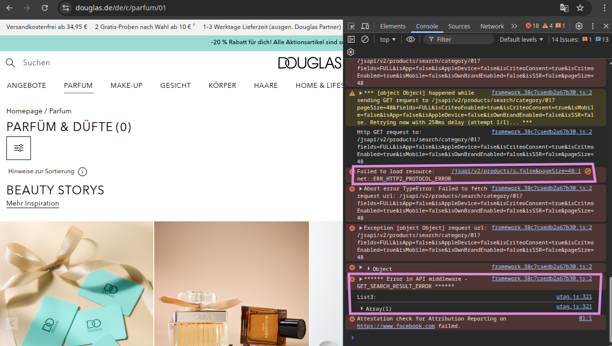

# Douglas UI Automation Test Suite

This project is a Playwright-based automated test suite for validating filter functionality on the Douglas website across multiple browsers (Chromium, Firefox, and WebKit).

## Project Structure

```
douglas_ui_automation/
├── common/                      # Shared test utilities and base classes
│   ├── baseTest.ts              # Base test configuration with fixtures
│   ├── CommonPage.ts            # Common page object methods
│   └── CommonScenario.ts        # Reusable test scenarios
├── locators/                    # Element locators for each page
│   ├── HomePageLocators.ts      # Home page selectors
│   ├── NuePageLocators.ts       # Nue page selectors
│   ├── PerfumePageLocators.ts   # Perfume page selectors
│   └── SalePageLocators.ts      # Sale page selectors
├── pages/                       # Page Object Models
│   ├── HomePage.ts              # Home page interactions
│   ├── NuePage.ts               # Nue page interactions
│   ├── PerfumePage.ts           # Perfume page interactions
│   └── SalePage.ts              # Sale page interactions
├── tests/                       # Test specifications
│   └── Douglas_Filters.spec.ts  # Filter validation tests
├── testdata/                    # Test data files
│   └── douglasFilterTestData.ts # Filter test data
├── utility/                     # Utility functions
│   └── logger.ts                # Winston logger configuration
├── logs/                        # Test execution logs
├── playwright-report/           # HTML test reports
├── test-results/                # Test result artifacts
├── allure-results/              # Allure report results
├── global-teardown.ts           # Global test teardown
├── playwright.config.ts         # Playwright configuration
├── package.json                 # Project dependencies
└── README.md                    # This file
```

## Prerequisites

- Node.js v16 or higher
- npm or yarn package manager

## Installation

1. Clone the repository:

```bash
git clone <repository-url>
cd douglas_ui_automation
```

2. Install dependencies:

```bash
npm install
```

This installs:

- `@playwright/test` v1.57.0 - Playwright testing framework
- `playwright` v1.57.0 - Browser automation library
- `winston` v3.19.0 - Logging utility
- `dotenv` v17.2.3 - Environment variable management
- `allure-playwright` v3.4.4 - Allure reporting

## Configuration

The test suite is configured via `playwright.config.ts` and supports multiple browsers.

### Browser Specifications

| Browser  | Configuration  | Details                       |
| -------- | -------------- | ----------------------------- |
| Chromium | slowMo: 2000ms | Chrome channel, standard      |
| Firefox  | slowMo: 2000ms | Firefox browser               |
| WebKit   | Default        | Safari-like desktop emulation |

### Key Configuration Settings

- **Test Directory**: `./tests`
- **Test Timeout**: 60 seconds per test
- **Parallel Execution**: Fully parallel mode enabled
- **Reporters**: Line reporter + Allure reporter
- **Trace Collection**: On first retry
- **Screenshots**: Only on failure
- **Global Teardown**: Closes browser after all tests

## Running Tests

```bash
# Run all tests across all browsers
npx playwright test

# Run tests on a specific browser
npx playwright test --project=chromium
npx playwright test --project=firefox
npx playwright test --project=webkit

# Interactive UI mode
npx playwright test --ui

# Debug mode with inspector
npx playwright test --debug

# Run specific test file
npx playwright test tests/Douglas_Filters.spec.ts

# Run with headed browser (visible)
npx playwright test --headed
```

## Test Results and Reports

### Playwright Report

```bash
# View HTML report
npx playwright show-report
```

**Location**: `playwright-report/index.html`

### Allure Report

The test suite uses Allure reporter for detailed test reporting with environment information.

**Location**: `allure-results/`

### Test Artifacts

- **Results**: `test-results/` directory
- **Logs**: `logs/` directory
- **Screenshots**: Captured on test failure
- **Traces**: Recorded on first retry for debugging

## Test Structure

The test suite uses the **Page Object Model** pattern with custom fixtures defined in `baseTest.ts`.

### Test Example

```typescript
import { test } from "../common/baseTest";

test("Test filter functionality", async ({ page, perfumePage }, testInfo) => {
  await test.step("Navigate to perfume page", async () => {
    await perfumePage.navigateToPerfumePage();
  });

  await test.step("Apply filter", async () => {
    await perfumePage.applyFilter("Brand", "TestBrand");
  });

  await test.step("Verify filter results", async () => {
    // assertions here
  });
});
```

### Available Fixtures

Custom fixtures provided by `baseTest.ts`:

- `page` - Playwright page object
- `homePage` - HomePage instance
- `perfumePage` - PerfumePage instance
- `nuePage` - NuePage instance
- `salePage` - SalePage instance
- `testInfo` - Test metadata and lifecycle information

## Key Features

- ✓ **Filter Verification**: Comprehensive filter testing across product pages (Perfume, Nue, Sale)
- ✓ **Multi-Browser Testing**: Chromium, Firefox, and WebKit support
- ✓ **Page Object Model**: Maintainable and scalable test architecture
- ✓ **Parallel Execution**: Tests run in parallel for faster feedback
- ✓ **Detailed Logging**: Winston logger for comprehensive debugging
- ✓ **Test Reporting**: Allure and Playwright HTML reports with environment details
- ✓ **Screenshot & Trace Capture**: Automatic capture on failures
- ✓ **Slow Motion Mode**: 2-second slowMo for visual debugging in browsers

## Environment Setup

Create or configure `execution_base.env` file in the project root:

```
BASE_URL=https://www.douglas.de/de
```

This environment variable is used to set the base URL for all test navigation.

## Troubleshooting

| Issue                       | Solution                                         |
| --------------------------- | ------------------------------------------------ |
| Browsers not installed      | Run `npx playwright install` to install browsers |
| Tests failing/timing out    | Check `logs/` directory, use `--debug` flag      |
| Slow performance            | Disable slowMo in playwright.config.ts or use CI |
| Network/connectivity issues | Verify internet and Douglas website availability |
| Bot blocker errors          | See "Known Issues" section below                 |
| Report not generated        | Verify Allure reporter configuration             |

## Best Practices

- **Page Objects**: Always use Page Objects for UI interactions instead of raw selectors in tests
- **Locator Management**: Maintain all selectors in dedicated locator files (e.g., `PerfumePageLocators.ts`)
- **Test Data**: Centralize test data in `testdata/` directory
- **Test Steps**: Break tests into logical `test.step()` blocks for better reporting
- **Logging**: Use the `logger.ts` utility for debugging and troubleshooting
- **Fixture Usage**: Leverage custom fixtures for page initialization
- **Test Independence**: Ensure tests don't depend on execution order
- **Timeout Handling**: Allow sufficient time for page loads and network requests

## Known Issues

### Bot Blocker on Douglas Website

The Perfume page (and potentially other pages) are unable to load product listings due to bot protection on the Douglas website. This results in:

- HTTP/2 Protocol errors during test execution
- Issues with the Search Results API
- Products not displaying on filtered searches

**Impact**: Tests that validate product listings may fail or show empty results.



### Related Artifacts

Detailed error information and screenshots are available in the `allure-results/` directory.

## Project Dependencies

| Package           | Version | Purpose               |
| ----------------- | ------- | --------------------- |
| @playwright/test  | ^1.57.0 | Testing framework     |
| playwright        | ^1.57.0 | Browser automation    |
| @types/node       | ^25.0.3 | TypeScript node types |
| winston           | ^3.19.0 | Logging               |
| dotenv            | ^17.2.3 | Environment variables |
| allure-playwright | 3.4.4   | Allure reporting      |
